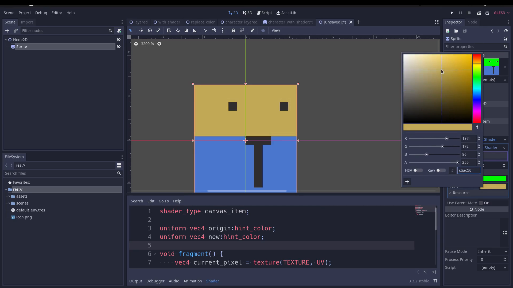

# Godot Image Color Replacement Example

This example contains 3 different approaches for changing colors from images dynamically in Godot. Useful for skin, hair and clothes.

Example created for this video: https://www.youtube.com/watch?v=sCZFttl8TZk

## Examples

`./scenes/example_layered.tscn`: Layered approach using modulate to change color from base layers.

`./scenes/example_with_shader.tscn`: Uses a shader to replace a defined color by another one.

`./scenes/example_pixel_color_replace.tscn`: Changes color pixel by pixel via GDScript.

